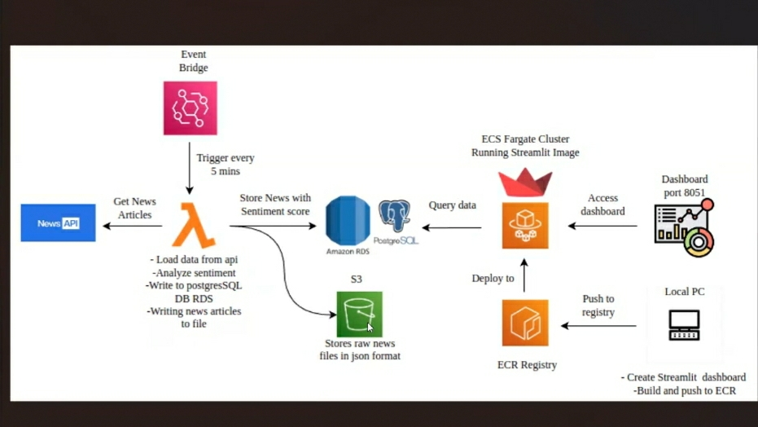
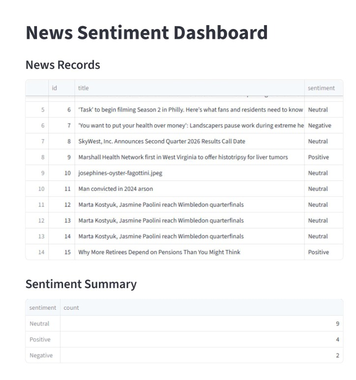

# real-time-news-sentiment-analysis
Real-Time News Sentiment Analysis using AWS Lambda, S3, RDS, Docker, ECS Fargate and Streamlit

# Real-Time News Sentiment Analysis Pipeline

A serverless data engineering project that automates the collection, storage, analysis, and visualization of real-time news sentiment using AWS services and Python.

## Project Overview

This project fetches the latest news articles from the NewsData.io API at scheduled intervals, stores the raw data in Amazon S3, processes and analyzes sentiment, stores the processed data in Amazon RDS PostgreSQL, and displays interactive insights through a Streamlit dashboard. The application is containerized with Docker and deployed on Amazon ECS Fargate.

---

## Architecture



---

## Tech Stack

### Programming Languages
- Python
- SQL

### AWS Services
- Amazon EventBridge
- AWS Lambda
- Amazon S3
- Amazon RDS (PostgreSQL)
- Amazon ECR
- Amazon ECS Fargate

### Libraries
- Requests
- Boto3
- Pandas
- TextBlob
- Psycopg2
- Streamlit
- Python-dotenv

### DevOps
- Docker
- Git
- GitHub

---

## Project Workflow

1. Amazon EventBridge triggers the AWS Lambda function every 5 minutes.
2. Lambda fetches the latest news from the NewsData.io API.
3. Raw JSON data is stored in Amazon S3.
4. News articles are processed and sentiment analysis is performed using TextBlob.
5. Processed data is inserted into Amazon RDS PostgreSQL.
6. Streamlit retrieves data from PostgreSQL.
7. Interactive dashboards display sentiment trends and news insights.
8. The Streamlit application is containerized using Docker and deployed to Amazon ECS Fargate via Amazon ECR.

---

## Repository Structure

```text
real-time-news-sentiment-analysis/
│
├── README.md
├── .gitignore
├── requirements.txt
│
├── lambda/
│   ├── lambda_function.py
│   ├── create_table_rds.py
│   ├── db_test.py
│   ├── news_api_test.py
│   ├── rds_test.py
│   ├── save_news.py
│   ├── save_to_db.py
│   ├── save_to_rds.py
│   ├── sentiment_test.py
│   └── upload_s3.py
│
├── dashboard/
│   ├── app.py
│   └── app2.py
│
├── sql/
│   ├── create_tables.sql
│   └── sample_queries.sql
│
├── docker/
│   └── Dockerfile
│
├── architecture/
│   └── architecture.jpeg
│
└── data/
    └── news_sentiment.csv
    
```

---

## Features

- Automated news ingestion
- Serverless architecture
- Scheduled execution using EventBridge
- Raw data storage in Amazon S3
- Sentiment analysis using TextBlob
- PostgreSQL database integration
- Interactive Streamlit dashboard
- Docker containerization
- ECS Fargate deployment
- Scalable and modular architecture

---

## Dashboard

### Sentiment Distribution, Latest News, Overall Analytics



---

## Environment Variables

Create a `.env` file using the following template.

```env
API_KEY=YOUR_NEWSDATA_API_KEY

DB_HOST= YOUR_DATABASE_HOST
DB_PORT= 5432
DB_NAME= YOUR_DATABASE_NAME
DB_USER= YOUR_DATABASE_USER
DB_PASSWORD= YOUR_DATABASE_PASSWORD

AWS_REGION= YOUR_AWS_REGION_NAME
S3_BUCKET_NAME= YOUR_S3_BUCKET_NAME
```

---

## Installation

### Clone the repository

```bash
git clone https://github.com/aleena-git-08/real-time-news-sentiment-analysis.git

cd real-time-news-sentiment-analysis
```

### Create a virtual environment

```bash
python -m venv venv
```

### Activate the environment

Windows

```bash
venv\Scripts\activate
```

Linux/macOS

```bash
source venv/bin/activate
```

### Install dependencies

```bash
pip install -r requirements.txt
```

---

## Running the Streamlit Dashboard

```bash
streamlit run app/app.py
```

---

## Docker

Build the Docker image

```bash
docker build -t news-dashboard -f docker/Dockerfile .
```

Run the container

```bash
docker run -p 8501:8501 news-dashboard
```

---

## AWS Deployment

1. Create an Amazon S3 bucket.
2. Configure the AWS Lambda function.
3. Add the NewsData API key as an environment variable.
4. Create an Amazon RDS PostgreSQL instance.
5. Configure EventBridge to trigger Lambda.
6. Build the Docker image.
7. Push the image to Amazon ECR.
8. Deploy the container using Amazon ECS Fargate.

---

## Future Improvements

- Real-time streaming with Amazon Kinesis
- NLP using Hugging Face Transformers
- Topic classification
- Named Entity Recognition
- CI/CD using GitHub Actions
- Monitoring with Amazon CloudWatch
- Unit and integration testing

---

## Author

**Aleena Mary D Aruja**

GitHub: https://github.com/aleena-git-08

LinkedIn: https://www.linkedin.com/in/aleena-mary-d-aruja-238839390 

---

## License

This project is licensed under the MIT License.